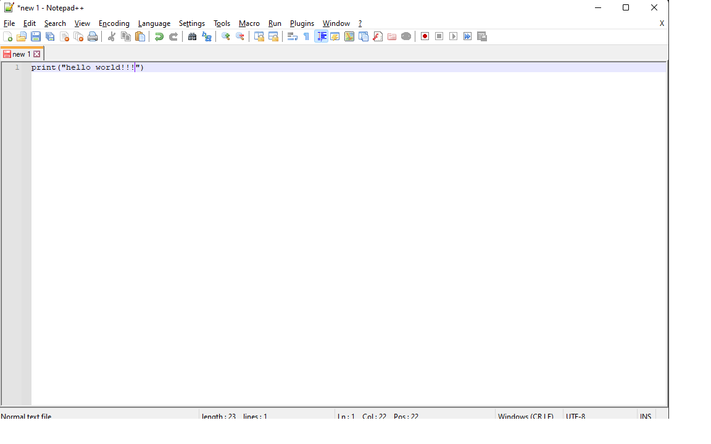

## CodeClub intro

### Intro round

### Course basics

- goals, methods, topics
  - 2 sessions per week (Mon-Wed)
  - homework (posted on Slack)
  - discussions on Slack  
- there will be guest lecturers
- not a bootcamp, no obligations, no guarantees
- can promise to teach the basics of Python
- read a lot of [realpython.com](realpython.com)


### Programming

What is a program?
topics: code, whitespace, comments, errors in Python

A program is a collection of instructions - we instruct the computer what to do, and it does exactly that. It does **exactly** what we tell it.
A program is executed line by line, one afer another, starting from the first line of a file. The "syntax" of a program follows a strict set of rules that the computer can understand

### Python

Python is one of many programming languages. It's very popular in many areas: 
- web development, 
- scientific computing, 
- bioinformatics (a strand of DNA as a sequence of characters)
- finance (financial analysis, stock trading)
- machine learning (image recognition)
- data science
- recommendation engines
- natural language processing (sentiment analysis, etc)
- gaming

A special program, called the interpreter, reads and executes our Python code.


Code looks like this:

```
cat = 'Jones'
```

In the above line, we've **assigned** a **value** to a **variable name**. A **variable** holds some value, so that we can re-use it later.

```
# Lines starting with # are comments
# These are not evaluated, these are meaningless to the computer
```


```
"""
This text you are reading now is also valid Python code (although it is a comment, or more specifically a docstring)
"""
```

## Data types


### Numeric types

- integers: `1, 2, 42`  
- floats: `3.0, 1.232, .01`

(There is a data type for complex numbers, but their usage is very rare)

### Strings


Strings represent **text**. They are between single or double quotes.

```
food = 'spaghetti'
```

```
other_food = "lasagne"
```

[Python docs](https://docs.python.org/3/tutorial/introduction.html?fbclid=IwAR3knUj3nO0-f2fYMS5Yb5MbGplB93buRymiE_07F06rufql14v5bKrzErk#strings)


### Booleans

Values representing "Boolean logic": True/False. 

`True` and `False` are the only boolean values.

This is a [good article about booleans](https://thomas-cokelaer.info/tutorials/python/boolean.html?fbclid=IwAR0mg4nzR6uQ4JvneWMGzLH6yiYzeb4Lo_C83ddo5vwXAcy_-lRdH61Q-Gw#notes-about-booleans-and-logical-operators).


### The type() built-in function

You can check the data type of a value using the built-in "type" function:
- type('pizza') will tell you that 'pizza' is a string, 
- type(1.0) will tell you that 1.0 is a float.


### Common operations of numeric types 

We can use the common mathematical operations on numbers: `+`, `-`, `*`, `**` (exponent), `/`, `//`, `%` (modulo)

The `//` operator does "floor division":

```
>>> 15 // 4
3
```

The modulo (`%`) gives you the **remainder** of a division:

```
>>> 15 % 4
3
```

```
>>> IBM_stock_price_yesterday = 126
>>> IBM_stock_price_today = 127
>>> stock_price_change = IBM_stock_price_today - IBM_stock_price_yesterday
>>> stock_price_change
1
```


### Common operations of strings

You can get the length of a string using the built-in `len` function:

```
>>> len('pizza')
5
```

We can make strings uppercase, lowercase, capitalized:

```
>>> 'broccoli'.upper()
'BROCCOLI'
>>> 'BEER'.lower()
'beer`
>>> 'joe'.capitalize()
'Joe'
```

(You might have noticed that we do this by appending a period (`.`) and then calling a function - these are called "methods" and we'll learn about them a bit later)

Strings can be added together

```
>>> 'I love ' + 'pizza'
'I love pizza'
```

We can check if a string starts with or ends with a particular prefix or suffix:

```
>>> 'tomato soup'.startswith('tomato')
True
```


You can count the number of times a string occurs in another string:

```
>>> foods = 'broccoli sausage pizza pizza hamburger spinach potatoes fris pizza pizza'
>>> foods.count('pizza')
4
```

You can "slice" them - this means that you can get a "substring" of them. For example, to get the first eight characters of the string from above, you could do:

```
>>> foods[0:8]
'broccoli'
```

You can do a lot with slicing. Check out this article: https://realpython.com/python-strings/#string-slicing


The full list of string methods can be seen [here in the official Python docs](https://docs.python.org/3/library/stdtypes.html#string-methods).


#### Common operations of Booleans

Common boolean operators are the following logical operators: `and`, `or` and `not`.

`and` returns `True` if both sides are true. Otherwise, it returns `False`.

```
>>> True and True
True
>>> True and False
False
```

`or` returns True if any of the two sides is True:

```
>>> True or False
True
>>> False or False
False
```

`not` returns the opposite boolean value:

```
>>> not True
False
>>> not False
True
```

### Lists

Lists are used to group together values. 

```
squares = [1, 4, 9, 16, 25]
```

You can put any data type into a list.

[Python docs](https://docs.python.org/3/tutorial/introduction.html?fbclid=IwAR3knUj3nO0-f2fYMS5Yb5MbGplB93buRymiE_07F06rufql14v5bKrzErk#lists)

#### Common operations of lists

Lists are very versatile, you can do a lot of things with them.

You can **slice** them, just like strings - remember the slicing operator `[start:end:step]`:

```
>>> my_list = [1, 2, 3]
>>> my_list[1:3]
[2, 3]
```

To get all the items except the last, you can use `[:-1]` which is shorthatd for `[0:-1:1]` (from element zero, until but not including the last one, in steps of one):

```
>>> my_list = [1, 2, 3]
>>> my_list[:-1]
[1, 2]
```


The third argument of the slice operator makes it possible to **skip items**, or to move through the list **backwards**:

```
>>> my_list = [1, 2, 3]
>>> my_list[0:3:2]
[1, 3]
```

You can use `my_list[::-1]` to traverse the list backwards `[::-1]` is a shorthand for "_from the beginning, to the end, in steps of minus one_":

```
>>> my_list = [1, 2, 3]
>>> my_list[::-1]
[3, 2, 1]
```


You can **index** them:

```
>>> my_list = [1, 2, 3]
>>> my_list[0]
1
```

You add an item to a list with the `append()` method:

```
>>> my_list = [1, 2, 3]
>>> my_list.append(4)
>>> my_list
[1, 2, 3, 4]
```

You can remove an item with the `remove()` method, and you can do a lot of other things - check out these articles for more:

- [RealPython](https://realpython.com/python-lists-tuples/#python-lists)
- [More on lists](https://docs.python.org/3/tutorial/datastructures.html#more-on-lists)


## Running Python files

Until now, we have been using Python __interactively__: we have opened the Python interpreter and have interacted with it.

However, usually, we prefer writing to a text file, and executing the text file with Python. This can be achieved by the following way (assuming you are using Windows):

- Download Notepad++ from [here](https://notepad-plus-plus.org/downloads/v8.2.1/). Any other text editor works too (Notepad, the built-in text editor of Windows is usable as well). Another good option is the [Atom](https://atom.io/) text editor.
- install it
- open Notepad++
- type `print("hello world!!!")`



- click File > Save as...  (or press Ctrl+S)

- pick a convenient location for the file - I suggest creating a "codeclub" directory in your User directory (which might be called something else, like your name)


- open the Command Prompt by pressing the Windows button and typing "cmd" and pressing Enter


- you will be presented with a black terminal, in your default user directory. 


- navigate to the directory where you have saved the file. This can be achieved by typing `cd` followed by the name of the directory you have used. I have saved the file in a directory called "codeclub" in my home directory (called "User"), so I had to type `cd codeclub`.

- If everything went well, the text "hello world!!!" will be printed on your terminal 🎉, yaay! 


## Control flow

### `if` statements

https://docs.python.org/3/tutorial/controlflow.html#if-statements

```
>>> x = int(input("Please enter an integer: "))
Please enter an integer: 42
>>> if x < 0:
...     x = 0
...     print('Negative changed to zero')
... elif x == 0:
...     print('Zero')
... elif x == 1:
...     print('Single')
... else:
...     print('More')
...
```


### `for` statements 


### `while` statements


